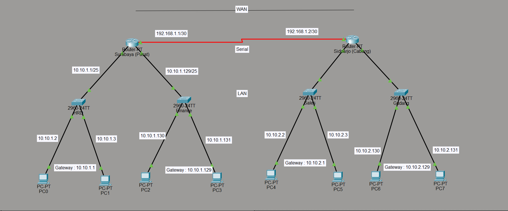

# 🌐 Site-to-Site Static Routing

## Deskripsi

Simulasi jaringan menggunakan Cisco Packet Tracer untuk menghubungkan kantor Surabaya dan Sidoarjo menggunakan koneksi point-to-point dan static routing.

## Jaringan

* Surabaya:

  * HRD → 10.10.1.0/25
  * Finance → 10.10.1.128/25

* Sidoarjo:

  * Sales → 10.10.2.0/25
  * Gudang → 10.10.2.128/25

* Link antar router:

  * 192.168.1.0/30 (Serial)

## Fitur

* Konfigurasi IP Address
* Static Routing
* Koneksi antar kantor

## Cara Menjalankan

1. Download file `.pkt`
2. Buka di Cisco Packet Tracer
3. Coba ping antar jaringan

## Hasil

Semua jaringan dapat saling terhubung dengan static routing.
